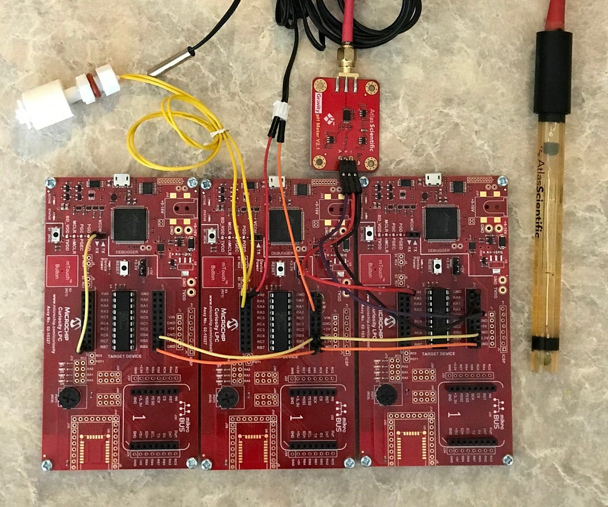
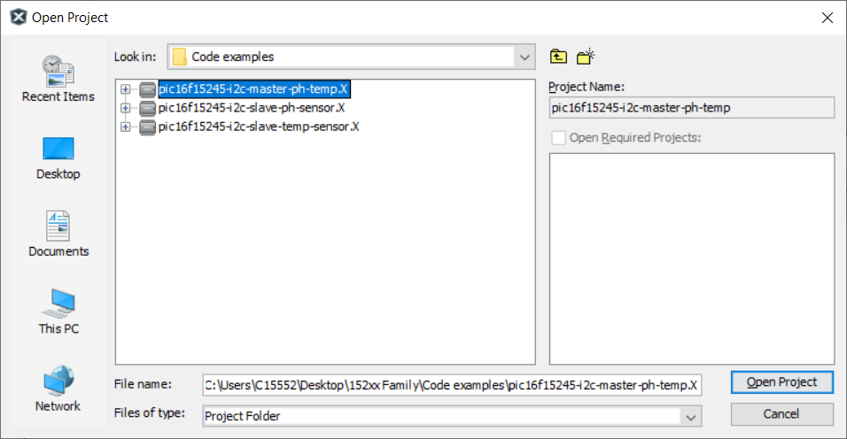
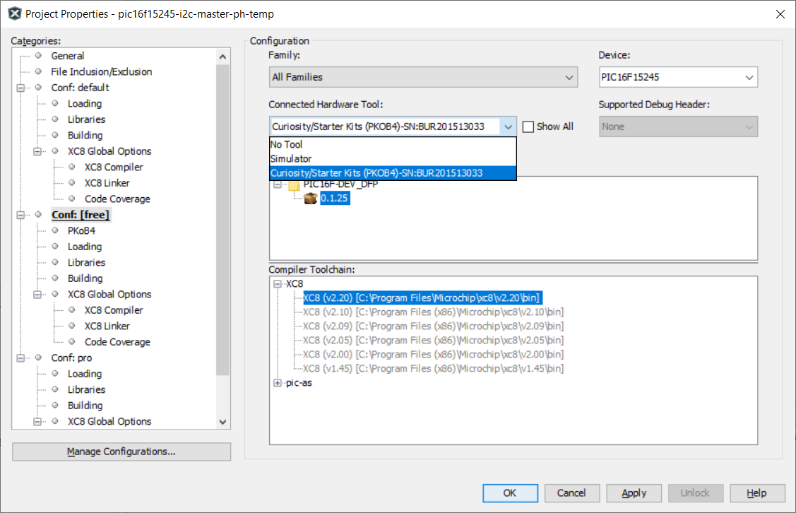
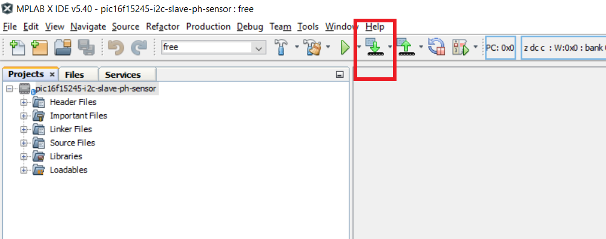
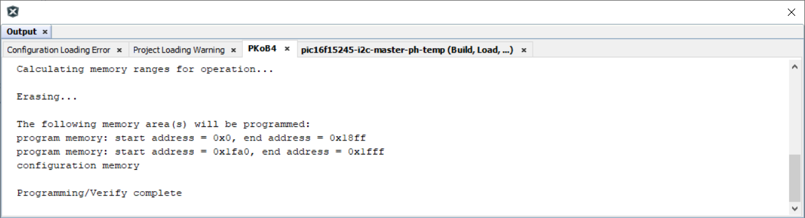
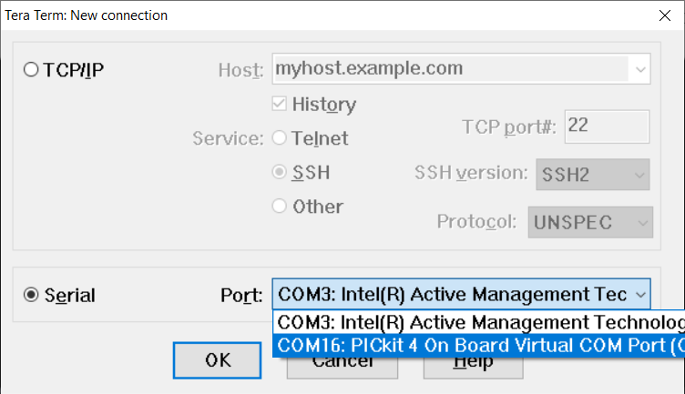
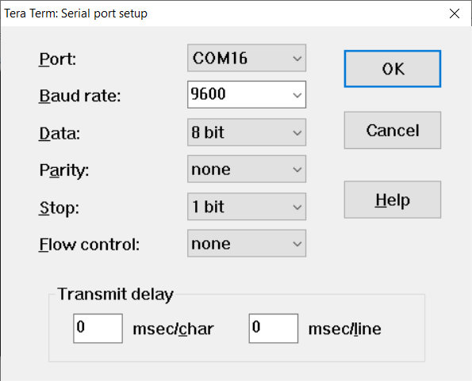
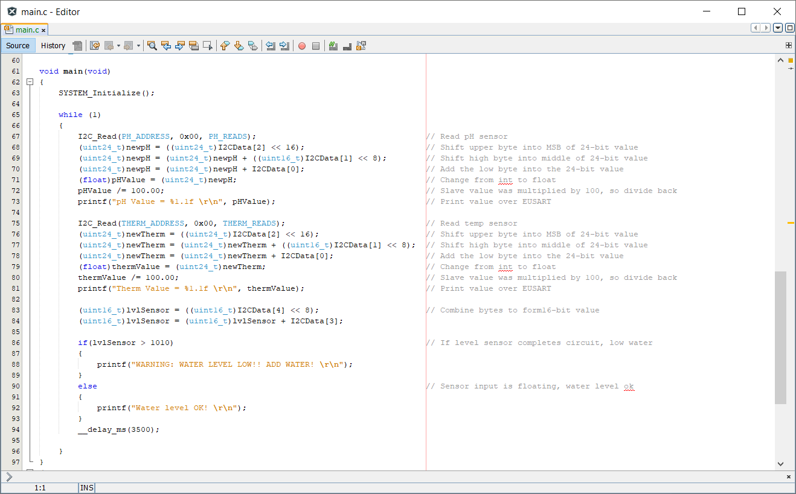
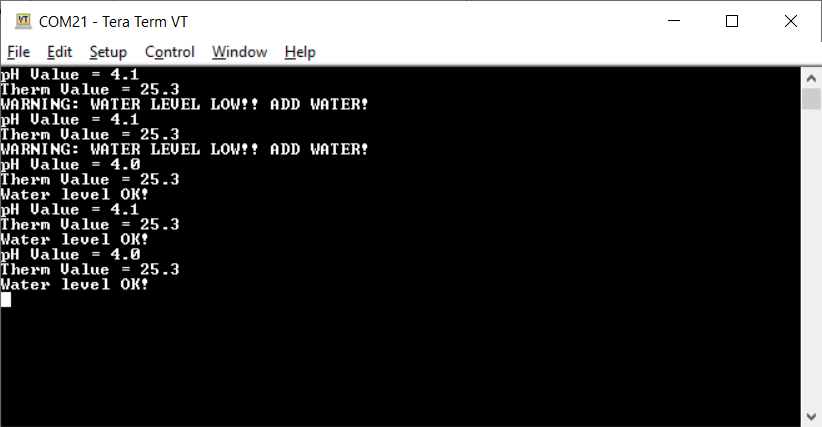

<!-- Please do not change this html logo with link -->

# I2C Master Mode pH and Temperature Sensing using PIC16F15245

The 'pic16f15245-i2c-master-ph-temp' code example highlights the use of the PIC16F15245 micrcontroller to communicate two I2C slaves, and transmit the slave data through the Enhanced Universal Syncronous Asyncronous Receiver Transmitter (EUSART) module to a PC terminal program. The slave devices read their respective sensors, perform any necessary calculations, and prepares the data for I2C transmission. This project should be combined with the two slave code examples listed in the 'Related Documentation' section to create a complete I2C bus.

## Related Documentation

- [PIC16F15245 Enhanced Mid-Range 8-bit Microcontroller Product Page](https://www.microchip.com/wwwproducts/en/PIC16F15245)
- [PIC16F15245 I2C Slave with pH Sensor Code Example](https://github.com/microchip-pic-avr-examples/pic16f15245-i2c-slave-ph-sensor.git)
- [PIC16F15245 I2C Slave with Temp Sensor Code Example](https://github.com/microchip-pic-avr-examples/pic16f15245-i2c-slave-temp-sensor.git)
- [AN3538 - A Simple Water Monitoring System with I2C Communication](https://www.microchip.com/wwwappnotes/appnotes.aspx?appnote=en1002965)

## Software Used

- MPLAB® X IDE 5.40 or newer [(microchip.com/mplab/mplab-x-ide)](http://www.microchip.com/mplab/mplab-x-ide)
- MPLAB® XC8 2.20 or newer compiler [(microchip.com/mplab/compilers)](http://www.microchip.com/mplab/compilers)
- MPLAB® Code Configurator (MCC) 3.95.0 or newer [(microchip.com/mplab/mplab-code-configurator)](https://www.microchip.com/mplab/mplab-code-configurator)
- MPLAB® Code Configurator (MCC) Device Libraries PIC10 / PIC12 / PIC16 / PIC18 MCUs [(microchip.com/mplab/mplab-code-configurator)](https://www.microchip.com/mplab/mplab-code-configurator)
- Microchip PIC16F1xxxx Series Device Support (1.4.119) or newer [(packs.download.microchip.com/)](https://packs.download.microchip.com/)

## Hardware Used

- [PIC16F15245](https://www.microchip.com/wwwproducts/en/PIC16F15245) 20-Lead PDIP Micrcontroller
- Curiosity Low Pin Count (LPC) Development Board - Rev 4 [(DM164137)](https://www.microchip.com/DevelopmentTools/ProductDetails/DM164137)
- Micro-USB to USB 2.0 cable
- Jumper wires

## Setup

1. Place the PIC16F15245 micrcontroller into the 20-pin socket of the Curiosity Low Pin Count (LPC) Development Board as shown in Figure 1.

  ##### Figure 1: Curiosity LPC Development Board
  

2. Connect a jumper wire from pin RB7 to the header pin labeled 'TX' as shown in Figure 2.

  ##### Figure 2: Jumper Wire from RB7 to TX
  

3. Using the two respective I2C slave boards from the 'pic16f15245-i2c-slave-ph-sensor' and 'pic16f15245-i2c-slave-temp-sensor' code examples, make the following connections as shown in Figure 3:
  1. Connect pin RB4 on the I2C master board to pin RB4 of one of the I2C slave boards.
  2. Connect pin RB4 on first I2C slave board to pin RB4 of the second slave board.
  3. Connect pin RB6 on the I2C master board to pin RB6 of the first slave board.
  4. Connect pin RB6 on the first slave board to pin RB6 of the second slave board.

  ##### Figure 3: Complete I2C Bus
  

4. Connect the I2C master's LPC board to a PC using the Micro-USB to USB 2.0 cable.
5. Program the PIC16F15245 Microcontroller:
   1. If not already on your system, download and install MPLABX IDE version 5.40 (or newer).
   2. If not already on your system, download and install the XC8 C-Compiler version 2.20 (or newer).
   3. Open the 'pic16f15245-i2c-master-ph-temp.X' project as shown in Figure 4.

    ###### Figure 4: Open the Project In MPLABX
    

   4. Press the 'Project Properites' button to open the Project Properties window. Select the Curiosity tool from the Tools drop-down menu as shown in Figure 5.

    ###### Figure 5: Select the LPC from Tools Menu
    

    5. Press the 'Make and Program Device' button to program the PIC (see Figure 6). Verify that the device was successfully programmed (see Figure 7).

    ###### Figure 6: Make and Program Device Button
    

    ###### Figure 7: Device Programming Successful
    

6. Open and configure a PC terminal program, such as Tera Term:
   1. Select the USB port associated with the LPC board as shown in Figure 8.

    ###### Figure 8: Select USB Port
    

   2. Configure the serial port as shown in Figure 9.

    ###### Figure 9: Serial Port Configuration
    

7. Connect the two slave boards to the PC (or USB power supply) using the Micro-USB to USB 2.0 cables.

8. Press the 'Reset' button on each of the two slave boards, then on the master board.

## Operation

The I2C master continuously requests the pH, temperature, and water level data from the two slaves. Each slave must convert it's data into bytes, ,which are then transmitted to the master. As the master receives the slave data, it loads a software array. The master must then reconstruct the slave data back into its original format (see Figure 10). For example, the pH sensor data uses a 24-bit floating-point value, which must be deconstructed into three bytes for I2C transmission. When the master receives the pH data, it reconstructs the three bytes back into a 24-bit float.

##### Figure 10: Master I2C Code Snippet

Once the data has been reconstructed, the information is passed to the PC terminal program using 'printf' statements. Figure 11 shows the final output.

##### Figure 11: PC Terminal Output

## Summary

The 'pic16f15245-i2c-master-ph-temp' code example highlights the use of the PIC16F15245 micrcontroller to communicate two I2C slaves, and transmit the slave data through the EUSART module to a PC terminal program. The slave devices read their respective sensors, perform any necessary calculations, and prepares the data for I2C transmission. This project should be combined with the two slave code examples listed in the 'Related Documentation' section to create a complete I2C bus.
